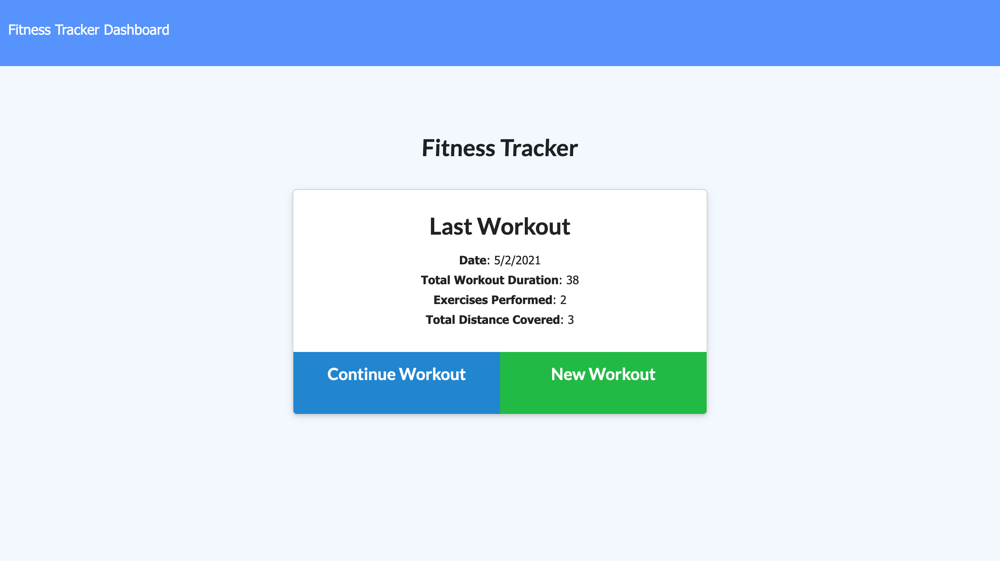
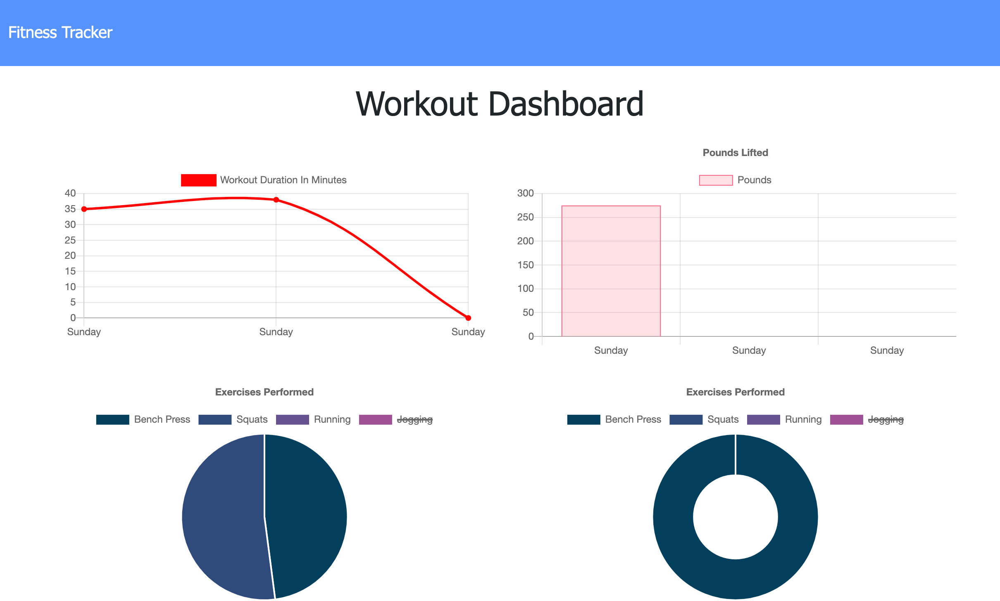
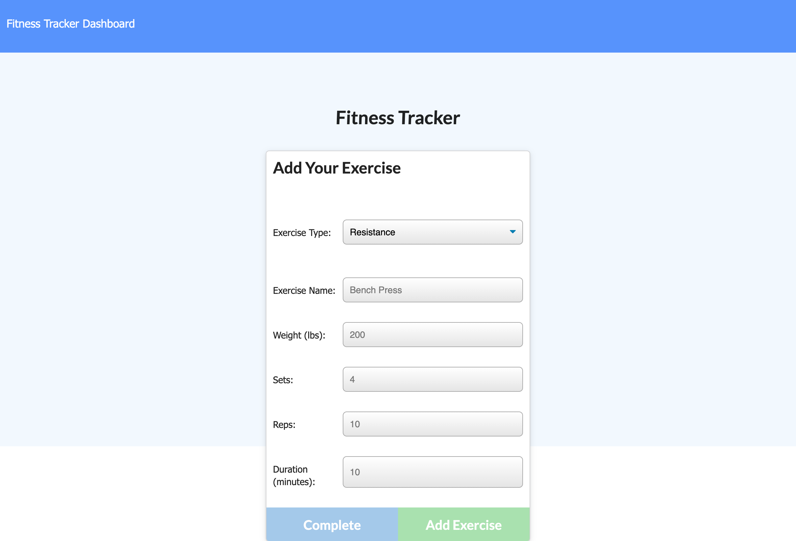

# Workout-Tracker

## Description

This application allows users to track their exercise stats and view a weekly overview of their workouts.

This application is intended to help individuals track their workouts for personal goals, such as stength gaining, weight loss, or general motivation.

Main challenges faced when creating this application was creating routes that returned the sum of workout duration and weight lifted. For future improvements, i would like to create a share function, which you can compare workouts to friends for additional challanges/motivation.

To view the live blog, click [here](https://sleepy-atoll-23080.herokuapp.com).

## Usage

As a user, you will start on the homepage that contains your last workout information and the ability to continue your workout or create a new one. If you would like to add a new exercise to the existing workout, click the "continue workout" button. To create a new workout, click on the "new workout" button.

The new workout button will take you to a page that has stat fields you can fill out. First select from the dropdown menu if the workout is resistance or cardio. This selection will populate additional fields that pertain to the type of workout. Once all fields are filled out, you can add the exercise to your workout.

To view a weekly overview of your workouts, you can click on the "dashbaord" option in the navbar. This dashboard will show a graph of your weekly workout durations, a graph of your weekly weight lifted, and two pie diagrams of your workout type information.

Please reference an image of the homepage, dashboard, and add new exercise page:

Homepage:

Dashboard:

Add new exercise:

## Credits

I would like to provide credit to [The Denver Univeristy Coding Bootcamp](https://bootcamp.du.edu/coding/) for providing me with the materials, intstructions, and one-on-one assistance to perform this project.

## Contact Information

To contact me, please feel free to email me at giochavez320@gmail.com.

## License

MIT License

Copyright &copy; 2021 Giovany Chavez, Brice Huisken, Dominick Rafiti, Keith Black

Permission is hereby granted, free of charge, to any person obtaining a copy
of this software and associated documentation files (the "Software"), to deal
in the Software without restriction, including without limitation the rights
to use, copy, modify, merge, publish, distribute, sublicense, and/or sell
copies of the Software, and to permit persons to whom the Software is
furnished to do so, subject to the following conditions:

The above copyright notice and this permission notice shall be included in all
copies or substantial portions of the Software.

THE SOFTWARE IS PROVIDED "AS IS", WITHOUT WARRANTY OF ANY KIND, EXPRESS OR
IMPLIED, INCLUDING BUT NOT LIMITED TO THE WARRANTIES OF MERCHANTABILITY,
FITNESS FOR A PARTICULAR PURPOSE AND NONINFRINGEMENT. IN NO EVENT SHALL THE
AUTHORS OR COPYRIGHT HOLDERS BE LIABLE FOR ANY CLAIM, DAMAGES OR OTHER
LIABILITY, WHETHER IN AN ACTION OF CONTRACT, TORT OR OTHERWISE, ARISING FROM,
OUT OF OR IN CONNECTION WITH THE SOFTWARE OR THE USE OR OTHER DEALINGS IN THE
SOFTWARE.